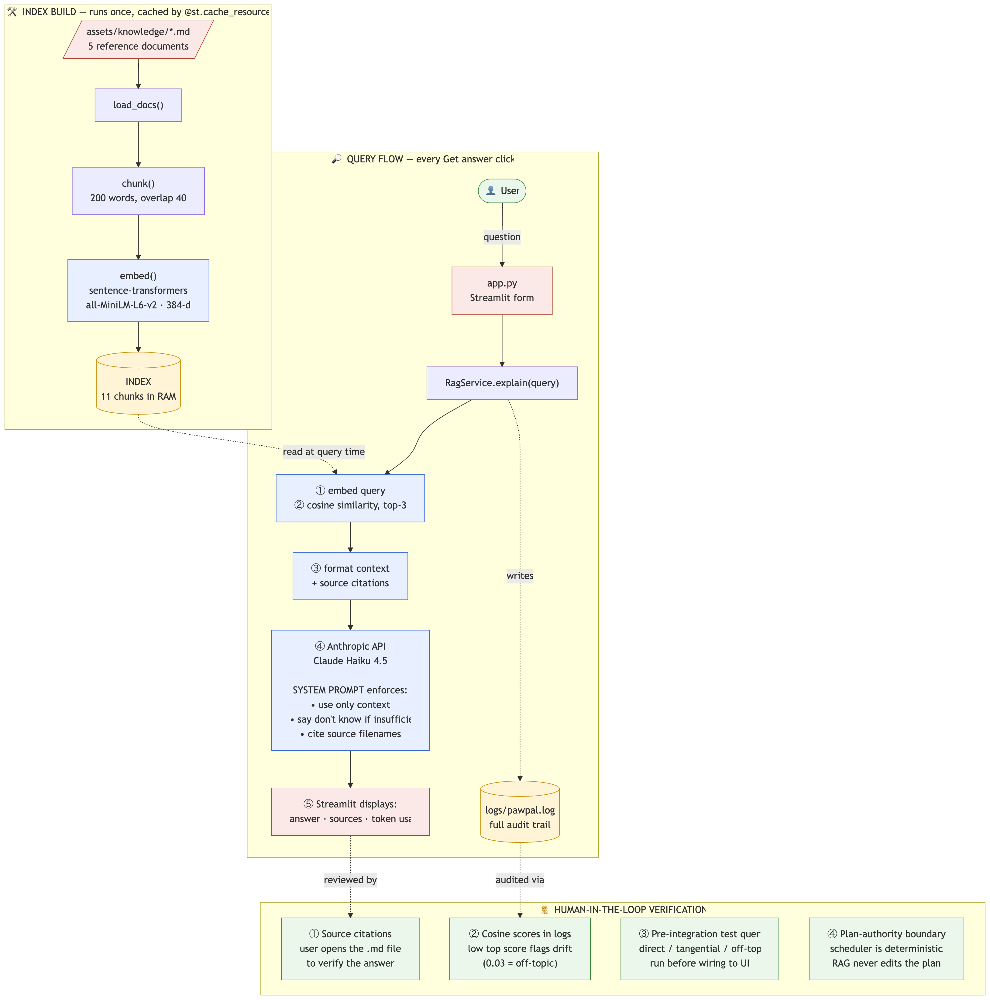

# PawPal+ — Pet Care Scheduler with Grounded AI Explanations

## Original Project (Module 2)

**PawPal+** started as a Streamlit pet care task scheduler. It lets a busy
owner enter pets and care tasks (walks, feeding, grooming, meds), then
generates a daily plan that respects time budget, task priority, and
owner preferences. The original build covered four classes (`Owner`,
`Pet`, `Task`, `Scheduler`), a two-pass greedy scheduler with conflict
detection, and 37 unit tests.

## Title and Summary

**PawPal+ now adds a RAG layer** that explains the generated plan using
trusted pet-care reference documents. After a schedule is created, the
owner can ask any pet-care question and get an answer grounded in the
knowledge base, with the source files cited. The deterministic
scheduler remains the source of truth — the AI only **explains**, it
never edits the plan.

This matters because pet care advice from raw LLMs is unreliable.
Grounding the model in vetted documents and forcing source citations
gives the owner an answer they can verify in seconds.


## Architecture Overview



The system has three phases:

1. **Index build** — at app startup, five markdown reference docs are
   loaded, chunked (200 words, 40-word overlap), embedded with
   `sentence-transformers/all-MiniLM-L6-v2`, and stored in memory.
   Streamlit caches this so it only runs once per session.
2. **Query flow** — when the user asks a question, the query is
   embedded, the top 3 chunks by cosine similarity are retrieved, and
   they are sent to Claude Haiku 4.5 along with a system prompt that
   enforces three rules: use only the provided context, say "I don't
   know" if it's insufficient, cite source filenames.
3. **Verification** — the user sees the answer with cited sources;
   every retrieval and LLM call is logged to `logs/pawpal.log` for
   audit; the scheduler stays deterministic, so a bad explanation can
   never produce a bad plan.

Full diagram and design notes: [rag_architecture.md](rag_architecture.md).

## Setup Instructions

```bash
# 1. Create a virtual environment and install dependencies
python3 -m venv .venv
source .venv/bin/activate          # Windows: .venv\Scripts\activate
pip install -r requirements.txt

# 2. Add your Anthropic API key
cp .env.example .env
# then edit .env and paste your key after ANTHROPIC_API_KEY=

# 3. Run the app
streamlit run app.py
```

To run the existing scheduler tests:

```bash
python3 -m pytest tests/test_pawpal.py -v
```

To smoke-test the RAG pipeline from the command line:

```bash
python3 pawpal_rag_explain.py "how often should I feed a young dog"
```

## Sample Interactions

Three queries were used to verify the grounding behavior across the
score landscape:

### 1. Direct match (cosine 0.66)

**Q:** *how often should I feed a young dog*

**A:** Returns a structured Markdown answer with puppy feeding
schedules by age (8–12 weeks: 4×/day, etc.), citing
`feeding_by_life_stage.md`. ✅ Confident answer when the docs cover it.

### 2. Tangential match (cosine 0.48)

**Q:** *my senior cat seems tired*

**A:** Claude hedges: *"the context provided focuses on scheduling and
care logistics rather than diagnosing health symptoms"*, then pivots to
the actually relevant chunk and recommends a vet visit. Cites
`vet_checkups_and_preventive_care.md`. ✅ Refuses to improvise from a
weakly-related chunk.

### 3. Off-topic (cosine 0.03)

**Q:** *what kind of pizza should I order*

**A:** *"I can't answer that question based on the provided context."*
Redirects the user to pet-care topics. ✅ Refuses cleanly when nothing
relevant exists.

## Design Decisions

- **Authority separation.** The scheduler in `pawpal_system.py` is
  deterministic and authoritative. The RAG layer in
  `pawpal_rag_service.py` only explains. The AI cannot break the plan.
- **Two grounding layers, not three.** The system prompt enforces
  citation and refusal rules. Source filenames are shown in the UI for
  human verification. We considered adding a hard cosine threshold to
  refuse low-confidence answers, but the prompt-based grounding handled
  the borderline (0.48) and off-topic (0.03) cases correctly on its
  own. Skipped the threshold to keep the system simple.
- **Dumb-on-purpose retriever.** Pure cosine similarity, no reranking,
  no hybrid search. Verified across direct, tangential, and off-topic
  queries before integration.
- **Cached service singleton.** The embedding model is ~90MB and takes
  several seconds to load. Streamlit reruns the script on every
  interaction, so the `RagService` is wrapped in `@st.cache_resource`
  to load once per session.
- **Streamlit-safe logging.** Reruns would otherwise stack duplicate
  log handlers on every interaction. A `if not logger.handlers:` guard
  ensures one handler per process.

## Testing Summary

### Reliability and Evaluation Plan

PawPal+ proves reliability through three complementary checks. **Unit
tests** (37/37 passing in `tests/test_pawpal.py`) verify the
deterministic scheduler, so the AI cannot affect plan correctness — it
runs independently. **Logging** captures every retrieval and LLM call
to `logs/pawpal.log`, including cosine scores, cited sources, token
usage, and full tracebacks on errors, so any failure is auditable
after the fact. **Human evaluation** closes the loop: cited source
filenames are shown in the UI alongside every answer, and three manual
test queries (direct, tangential, off-topic) confirmed that the model
hedges and refuses correctly when the retrieved context is weak.

**Scheduler:** 37/37 unit tests passing in `tests/test_pawpal.py`,
covering task validation, recurring tasks, assignment rules, scheduler
behavior, conflict detection, and owner registration.

**RAG:** Manual smoke tests across three query categories (direct,
tangential, off-topic). Behavior validated against the cosine score
landscape:

| Query type | Top score | Expected behavior | Observed |
|---|---|---|---|
| Direct | ~0.66 | Confident answer with citation | ✅ |
| Tangential | ~0.48 | Hedge, pivot, suggest vet | ✅ |
| Off-topic | ~0.03 | Refuse, redirect | ✅ |

**What worked:** Prompt-based grounding handled all three cases
without a hard cosine threshold. Cited source filenames let a human
verify any answer in seconds.

**What didn't (initially):** I started planning a hard cosine
threshold guardrail before testing. After running the three queries, I
realized the prompt grounding alone was sufficient and the threshold
would have added complexity without benefit. The lesson: validate
behavior before adding defenses.

**What I learned:** RAG quality depends more on prompt design and
chunk relevance than on retrieval cleverness. The simplest pipeline
that passes the test cases is the right pipeline for an MVP.

## Reflection

The biggest lesson from this project was that **AI grounds well when
you give it the right structure and refuses well when you ask it to**.
Out of the box, an LLM will happily improvise an answer about a tired
senior cat. With three clear instructions in the system prompt — use
only the context, say I don't know, cite sources — the same model
hedges, pivots, and recommends a vet visit instead.

The other lesson was about **resisting over-engineering**. My instinct
was to add multiple guardrails, log filters, and confidence thresholds
before I had data on whether they were needed. Walking through one
concept at a time (load → chunk → embed → retrieve → generate),
testing each layer, and only adding the next piece when the previous
one was solid kept the project on track and inside the time budget.

Working with Claude on this taught me that **the best prompts describe
the goal and ask for weaknesses**. Asking "what could break this?"
gave me concrete, actionable feedback. Asking "make it better" gave me
sprawl. That distinction matters more than any individual technique.
