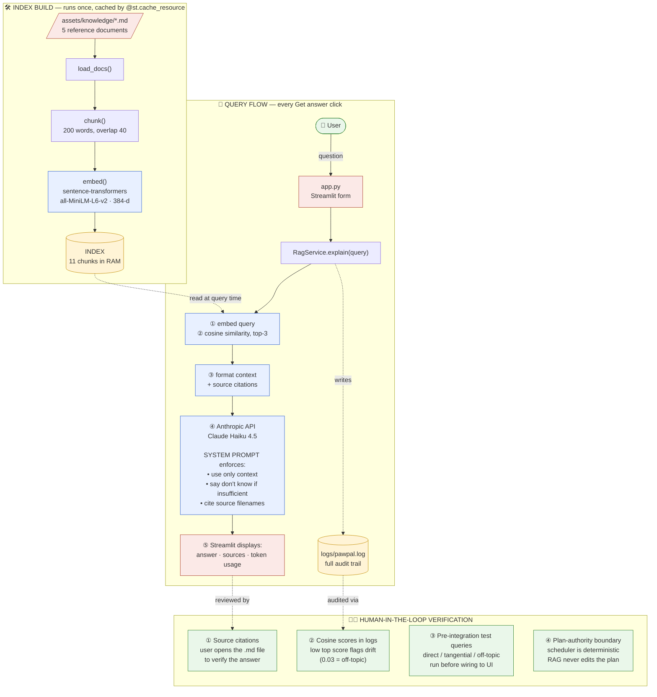

# PawPal+ RAG Architecture

This diagram shows how the Retrieval-Augmented Generation (RAG) layer
fits into PawPal+. The deterministic scheduler in `pawpal_system.py` is
the source of truth for plans; the RAG layer only **explains** plans
with cited evidence — it never edits them.

## Data flow summary

| Phase | Trigger | Cost | Artifact |
|---|---|---|---|
| Index build | App startup (cached) | ~3 sec, no API | `INDEX` (in-memory, 11 chunks × 384-d) |
| Per query | User clicks **Get answer** | ~1–2 sec, ~$0.002 | Answer + sources + log line |

## Architectural decisions

- **Authority separation.** The scheduler is the single source of truth for *what* happens; the RAG layer only adds explanation *about* what happens. The AI can hallucinate freely without breaking the schedule — failure mode is "wrong explanation," not "wrong plan."
- **Two grounding layers.** Prompt rules (model-enforced) plus cited source filenames (human-verifiable). Cosine scores in logs add a third layer for after-the-fact audit.
- **Dumb-on-purpose retriever.** Pure cosine similarity, no reranking, no thresholding. Verified across direct (0.66), tangential (0.48), and off-topic (0.03) queries — the system prompt handles edge cases without a hard threshold.
